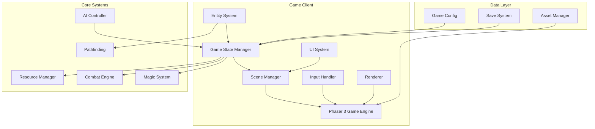
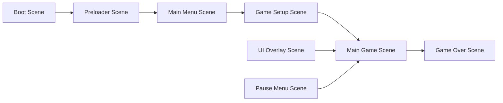

# RTS Game Design Document

## Overview

This design document details the technical architecture and implementation approach for the RTS game combining Heroes of Might and Magic and Red Alert elements. The game will be built using Phaser 3 framework with a focus on real-time gameplay, strategic depth, and scalable architecture.

## Architecture

### High-Level Architecture



### Scene Architecture

The game will use Phaser 3's scene system with the following structure:



#### Scene Descriptions

- **Boot Scene**: Initialize game configuration and load essential assets
- **Preloader Scene**: Load all game assets with progress bar
- **Main Menu Scene**: Title screen with game options
- **Game Setup Scene**: Configure game settings (map size, players, difficulty)
- **Main Game Scene**: Core gameplay with tilemap and entities
- **UI Overlay Scene**: Persistent UI elements (resource bar, minimap, command panels)
- **Pause Menu Scene**: In-game pause with settings
- **Game Over Scene**: Victory/defeat screen with statistics

## Components and Interfaces

### Core Components

#### 1. Game State Manager
```javascript
class GameStateManager {
    constructor(config) {
        this.config = config;
        this.players = [];
        this.currentTick = 0;
        this.gameSpeed = CONFIG.get('time.baseGameSpeed');
        this.isPaused = false;
        this.winner = null;
        this.pausedSystems = [];
    }
    
    update(delta) {
        if (this.isPaused) {
            return; // Skip all updates when paused
        }
        
        // Apply game speed modifier
        const adjustedDelta = delta * this.gameSpeed;
        
        // Update game tick
        this.currentTick += adjustedDelta;
        
        // Process resource generation
        this.players.forEach(player => {
            if (player.isAlive) {
                player.resourceManager.update(adjustedDelta);
            }
        });
        
        // Check victory conditions
        this.checkVictoryConditions();
    }
    
    pause() {
        this.isPaused = true;
        
        // Store state of time-sensitive systems
        this.pausedSystems = {
            magicSystemTime: this.magicSystem?.lastSelectionTime,
            productionQueues: new Map(),
            movingArmies: []
        };
        
        // Freeze all active systems
        this.entities.forEach(entity => {
            if (entity.type === 'army') {
                const movement = entity.getComponent('movement');
                if (movement?.isMoving) {
                    this.pausedSystems.movingArmies.push({
                        entity: entity,
                        progress: movement.movementProgress
                    });
                }
            }
        });
    }
    
    unpause() {
        this.isPaused = false;
        
        // Restore time-sensitive systems
        if (this.pausedSystems) {
            if (this.magicSystem) {
                this.magicSystem.lastSelectionTime = this.pausedSystems.magicSystemTime;
            }
            
            // Restore movement progress
            this.pausedSystems.movingArmies.forEach(({ entity, progress }) => {
                const movement = entity.getComponent('movement');
                if (movement) {
                    movement.movementProgress = progress;
                }
            });
        }
        
        this.pausedSystems = null;
    }
    
    addPlayer(playerConfig) {}
    removePlayer(playerId) {}
    checkVictoryConditions() {}
}
```

#### 2. Entity Component System

```javascript
class Entity {
    constructor(id, type, owner) {
        this.id = id;
        this.type = type;
        this.owner = owner;
        this.components = new Map();
    }
    
    addComponent(name, component) {}
    getComponent(name) {}
    removeComponent(name) {}
}

// Component examples
class PositionComponent {
    constructor(x, y) {
        this.x = x;
        this.y = y;
        this.tileX = Math.floor(x / TILE_SIZE);
        this.tileY = Math.floor(y / TILE_SIZE);
    }
}

class CombatComponent {
    constructor(power, isRanged = false) {
        this.power = power;
        this.isRanged = isRanged;
        this.bonuses = [];
    }
}

class MovementComponent {
    constructor(speed) {
        this.baseSpeed = speed;
        this.currentSpeed = speed;
        this.path = [];
        this.isMoving = false;
        this.movementProgress = 0;
    }
    
    calculateEffectiveSpeed(terrainConfig) {
        return this.baseSpeed * (terrainConfig.movementModifier || 1.0);
    }
}
```

#### 3. Castle System

```javascript
class Castle extends Entity {
    constructor(id, owner, tileX, tileY, faction) {
        super(id, 'castle', owner);
        this.faction = faction;
        this.buildings = [];
        this.garrisonArmy = null;
        this.productionQueue = [];
        this.level = 1;
        
        // Add components
        this.addComponent('position', new PositionComponent(tileX * TILE_SIZE, tileY * TILE_SIZE));
        this.addComponent('resource', new ResourceGeneratorComponent());
        this.addComponent('defense', new DefenseComponent());
    }
    
    addBuilding(buildingType) {}
    produceUnit(unitType) {}
    setGarrison(army) {}
}

class Building {
    constructor(type, castle) {
        this.type = type;
        this.castle = castle;
        this.level = 1;
        this.productionRate = BUILDING_CONFIGS[type].baseRate;
    }
    
    upgrade() {}
    getProductionBonus() {}
}
```

#### 4. Army System

```javascript
class Army extends Entity {
    constructor(id, owner) {
        super(id, 'army', owner);
        this.units = new Map(); // unitType -> count
        this.spellQueue = [];
        
        // Army speed is the average of all unique unit type speeds
        // Example: 100 swordsmen (speed 10) + 50 archers (speed 5) = army speed of 7.5
        // The quantities (100, 50) don't affect the calculation
        this.addComponent('position', new PositionComponent(0, 0));
        this.addComponent('movement', new MovementComponent(this.calculateSpeed()));
        this.addComponent('combat', new CombatComponent(this.calculatePower()));
    }
    
    addUnits(unitType, count) {}
    removeUnits(unitType, count) {}
    calculatePower() {
        let totalPower = 0;
        this.units.forEach((count, unitType) => {
            const unitConfig = UNIT_CONFIGS[this.owner.faction][unitType];
            totalPower += unitConfig.power * count;
        });
        return totalPower;
    }
    
    calculateSpeed() {
        let totalSpeed = 0;
        let unitTypeCount = 0;
        
        // Calculate average speed based on unique unit types only
        // Unit quantities do not affect army speed
        this.units.forEach((count, unitType) => {
            if (count > 0) {  // Only count unit types that are present
                const unitConfig = UNIT_CONFIGS[this.owner.faction][unitType];
                totalSpeed += unitConfig.speed;
                unitTypeCount++;
            }
        });
        
        // Return average speed of unit types
        return unitTypeCount > 0 ? totalSpeed / unitTypeCount : 0;
    }
    
    merge(otherArmy) {
        otherArmy.units.forEach((count, unitType) => {
            const currentCount = this.units.get(unitType) || 0;
            this.units.set(unitType, currentCount + count);
        });
        
        // Update components after merge
        this.getComponent('combat').power = this.calculatePower();
        this.getComponent('movement').baseSpeed = this.calculateSpeed();
    }
    
    split(unitDistribution) {
        const newArmy = new Army(generateId(), this.owner);
        
        unitDistribution.forEach(({ unitType, count }) => {
            const currentCount = this.units.get(unitType) || 0;
            if (currentCount >= count) {
                newArmy.units.set(unitType, count);
                this.units.set(unitType, currentCount - count);
            }
        });
        
        // Update both armies' components
        this.getComponent('combat').power = this.calculatePower();
        this.getComponent('movement').baseSpeed = this.calculateSpeed();
        newArmy.getComponent('combat').power = newArmy.calculatePower();
        newArmy.getComponent('movement').baseSpeed = newArmy.calculateSpeed();
        
        return newArmy;
    }
}

class Unit {
    constructor(type, faction) {
        this.type = type;
        this.faction = faction;
        // Unit properties come from configuration - all units of the same type have identical stats
        this.basePower = UNIT_CONFIGS[faction][type].power;
        this.baseSpeed = UNIT_CONFIGS[faction][type].speed;  // Speed is a property of unit type, not individual units
        this.abilities = UNIT_CONFIGS[faction][type].abilities || [];
    }
}
```

#### 5. Resource System

```javascript
class ResourceManager {
    constructor(player) {
        this.player = player;
        this.resources = {
            gold: 0,
            mana: 0,
            wood: 0,
            stone: 0,
            mercury: 0,
            sulfur: 0,
            crystal: 0
        };
        this.generation = {
            gold: 0,
            mana: 0
        };
    }
    
    update(delta) {
        // Apply generation rates
        this.resources.gold += (this.generation.gold * delta / 60000); // per minute
        this.resources.mana += (this.generation.mana * delta / 60000);
    }
    
    canAfford(cost) {}
    spend(cost) {}
    add(resources) {}
}
```

### UI System Design

#### Command Panel Architecture

```javascript
class CommandPanel extends Phaser.GameObjects.Container {
    constructor(scene, x, y) {
        super(scene, x, y);
        this.background = this.createBackground();
        this.buttons = [];
        this.currentSelection = null;
    }
    
    showEntityCommands(entity) {
        this.clearButtons();
        
        if (entity.type === 'castle') {
            this.showCastleCommands(entity);
        } else if (entity.type === 'army') {
            this.showArmyCommands(entity);
        }
    }
    
    createButton(x, y, text, callback) {}
    clearButtons() {}
}

class ResourceBar extends Phaser.GameObjects.Container {
    constructor(scene, player) {
        super(scene, 0, 0);
        this.player = player;
        this.resourceDisplays = this.createResourceDisplays();
    }
    
    update() {
        // Update resource display values
    }
}

class Minimap extends Phaser.GameObjects.Container {
    constructor(scene, worldWidth, worldHeight) {
        super(scene, 0, 0);
        this.worldWidth = worldWidth;
        this.worldHeight = worldHeight;
        this.minimapTexture = this.createMinimapTexture();
    }
    
    updateVisibility(visibleTiles) {}
    updateEntityPositions(entities) {}
}
```

## Data Models

### Configuration Data

```javascript
// Centralized configuration system with no magic numbers
const GAME_CONFIG = {
    // Map configuration
    map: {
        tileSize: 64,
        defaultSize: 64,
        minSize: 32,
        maxSize: 256,
        fogOfWarEnabled: true
    },
    
    // Time configuration (all in milliseconds)
    time: {
        baseGameSpeed: 1.0,
        resourceUpdateInterval: 1000, // 1 second
        spellSelectionInterval: 60000, // 60 seconds
        aiDecisionInterval: 10000, // 10 seconds
        autosaveInterval: 300000 // 5 minutes
    },
    
    // Movement configuration
    movement: {
        baseTimePerTile: 1000, // 1 second to cross one tile at speed 1
        speedUnit: 'tilesPerSecond', // How speed values are interpreted
        minEffectiveSpeed: 0.1, // Minimum speed to prevent division by zero
        maxEffectiveSpeed: 1000 // Maximum speed cap
    },
    
    // Resource configuration
    resources: {
        baseGeneration: {
            gold: 60,  // per minute
            mana: 60   // per minute
        },
        startingResources: {
            gold: 0,
            mana: 0,
            wood: 0,
            stone: 0,
            mercury: 0,
            sulfur: 0,
            crystal: 0
        },
        economicVictory: {
            gold: 10000,
            rareResourceAmount: 1000
        }
    },
    
    // Faction configuration
    factions: {
        human: {
            resourceBonus: {
                gold: 1.25,
                mana: 1.25
            },
            unitProductionSpeed: 1.0,
            startingUnits: ['swordsman', 'archer']
        },
        orc: {
            resourceBonus: {
                gold: 1.25,
                mana: 1.0
            },
            unitProductionSpeed: 1.2,
            startingUnits: ['warrior', 'archer']
        }
    },
    
    // Army configuration
    army: {
        maxRegularUnits: 7,
        maxSiegeUnits: 1,
        mergeDistance: 2, // tiles
        selectionRadius: 1 // tiles
    },
    
    // Combat configuration
    combat: {
        baseDefenseMultiplier: 1.0,
        castleDefenseMultiplier: 1.5,
        siegeAntiCastleBonus: 1.5,
        spellDamageMultiplier: 1.0
    },
    
    // UI configuration
    ui: {
        notificationDuration: 5000, // 5 seconds
        doubleClickTime: 300, // milliseconds
        scrollSpeed: 10,
        zoomLevels: [0.5, 0.75, 1.0, 1.25, 1.5],
        defaultZoom: 1.0
    },
    
    // Performance configuration
    performance: {
        maxVisibleEntities: 200,
        cullingMargin: 100, // pixels
        pathfindingCacheSize: 100,
        objectPoolSizes: {
            projectiles: 50,
            effects: 100,
            ui: 20
        }
    }
};

// Terrain configuration with movement modifiers
const TERRAIN_CONFIG = {
    grassland: { 
        movementModifier: 1.0, 
        passable: true,
        combatModifier: 1.0,
        visionModifier: 1.0
    },
    mountain: { 
        movementModifier: 0, // impassable
        passable: false,
        combatModifier: 1.0,
        visionModifier: 1.0
    },
    forest: { 
        movementModifier: 0.5, // 50% speed
        passable: true, 
        combatModifier: 1.1, // 10% combat bonus
        visionModifier: 0.8
    },
    water: { 
        movementModifier: 0, // impassable
        passable: false,
        combatModifier: 1.0,
        visionModifier: 1.0
    },
    road: { 
        movementModifier: 2.0, // 200% speed
        passable: true,
        combatModifier: 1.0,
        visionModifier: 1.0
    },
    desert: { 
        movementModifier: 0.67, // ~67% speed
        passable: true, 
        combatModifier: 1.0,
        visionModifier: 0.8
    },
    plains: { 
        movementModifier: 1.0,
        passable: true,
        combatModifier: 1.0,
        visionModifier: 1.0
    },
    swamp: { 
        movementModifier: 0.5, // 50% speed
        passable: true, 
        combatModifier: 1.1, // 10% combat bonus
        visionModifier: 0.9
    },
    snow: { 
        movementModifier: 0.67, // ~67% speed
        passable: true, 
        combatModifier: 1.0,
        visionModifier: 0.8
    },
    lake: { 
        movementModifier: 0.5, // 50% speed
        passable: true, 
        combatModifier: 0.9, // 10% combat penalty
        visionModifier: 1.0
    }
};

// Unit configurations with speed values representing tiles per second at base speed
const UNIT_CONFIGS = {
    human: {
        // Speed values: tiles per second (higher = faster)
        swordsman: { power: 5, speed: 10, cost: { gold: 50 } },  // 10 tiles/sec = 0.1 sec per tile
        archer: { power: 8, speed: 5, cost: { gold: 75 }, isRanged: true },  // 5 tiles/sec = 0.2 sec per tile
        knight: { power: 20, speed: 100, cost: { gold: 200 } },  // 100 tiles/sec = 0.01 sec per tile (very fast)
        wizard: { power: 15, speed: 10, cost: { gold: 150, mana: 50 }, canCastSpells: true },
        paladin: { power: 50, speed: 80, cost: { gold: 500 }, ability: 'powerBoost' }
    },
    orc: {
        warrior: { power: 6, speed: 10, cost: { gold: 50 } },
        archer: { power: 9, speed: 5, cost: { gold: 75 }, isRanged: true },
        wolfRider: { power: 15, speed: 120, cost: { gold: 180 } },  // Fastest unit
        shaman: { power: 14, speed: 10, cost: { gold: 140, mana: 40 }, canCastSpells: true },
        berserker: { power: 55, speed: 75, cost: { gold: 550 }, ability: 'rage' },
        ogre: { power: 30, speed: 15, cost: { gold: 300 }, antiCastle: 1.5 }  // Slow but powerful
    }
};

const BUILDING_CONFIGS = {
    // Unit production
    barracks: { 
        cost: { gold: 500, wood: 100 }, 
        produces: ['swordsman', 'warrior'],
        baseRate: 60000  // 1 unit per minute
    },
    archeryRange: { 
        cost: { gold: 750, wood: 150 }, 
        produces: ['archer'],
        baseRate: 90000
    },
    stables: { 
        cost: { gold: 1500, wood: 200, stone: 100 }, 
        produces: ['knight', 'wolfRider'],
        baseRate: 120000
    },
    magicTower: { 
        cost: { gold: 2000, stone: 200, crystal: 50 }, 
        produces: ['wizard', 'shaman'],
        baseRate: 150000
    },
    
    // Resource generation
    goldMine: { 
        cost: { gold: 1000, stone: 100 }, 
        generates: { gold: 30 }  // per minute bonus
    },
    manaWell: { 
        cost: { gold: 1000, crystal: 50 }, 
        generates: { mana: 30 }
    },
    
    // Defense
    walls: { 
        cost: { gold: 2000, stone: 500 }, 
        defenseBonus: 1.5,
        hitPoints: 1000
    },
    watchtower: { 
        cost: { gold: 500, wood: 200 }, 
        visionRange: 10,
        defenseBonus: 1.2
    }
};
```

### Game State Model

```javascript
class GameState {
    constructor() {
        this.players = [];
        this.entities = new Map();
        this.map = null;
        this.visibility = new Map(); // playerId -> visible tiles
        this.currentTick = 0;
        this.gameSpeed = 1.0;
        this.settings = {
            mapSize: 64,
            difficulty: 'normal',
            maxPlayers: 8,
            victoryConditions: ['elimination', 'economic']
        };
    }
    
    serialize() {
        // Convert to saveable format
    }
    
    deserialize(data) {
        // Load from saved data
    }
}

class Player {
    constructor(id, name, faction, isAI = false) {
        this.id = id;
        this.name = name;
        this.faction = faction;
        this.isAI = isAI;
        this.resourceManager = new ResourceManager(this);
        this.spellLibrary = [];
        this.isAlive = true;
        this.color = this.assignColor();
    }
}
```

## Combat System Design

### Combat Resolution Algorithm

```javascript
class CombatEngine {
    resolveCombat(attacker, defender, terrain) {
        // Get base powers
        let attackerPower = attacker.getComponent('combat').power;
        let defenderPower = defender.getComponent('combat').power;
        
        // Apply terrain modifiers
        const terrainConfig = TERRAIN_CONFIG[terrain.type];
        attackerPower *= terrainConfig.combatModifier || 1.0;
        defenderPower *= terrainConfig.combatModifier || 1.0;
        
        // Apply castle defense bonus if applicable
        if (defender.type === 'castle') {
            const defenseComp = defender.getComponent('defense');
            const defenseMultiplier = CONFIG.get('combat.castleDefenseMultiplier');
            defenderPower = (defenderPower + defenseComp.buildingPower) * defenseMultiplier;
        }
        
        // Resolve spells first
        this.resolveSpells(attacker, defender);
        
        // Apply spell effects
        attackerPower *= this.getSpellMultiplier(attacker);
        defenderPower *= this.getSpellMultiplier(defender);
        
        // Determine winner
        if (attackerPower > defenderPower) {
            return {
                winner: attacker,
                remainingPower: attackerPower - defenderPower,
                loser: defender
            };
        } else if (defenderPower > attackerPower) {
            return {
                winner: defender,
                remainingPower: defenderPower - attackerPower,
                loser: attacker
            };
        } else {
            return {
                winner: null,
                remainingPower: 0,
                loser: null,
                draw: true
            };
        }
    }
    
    resolveSpells(attacker, defender) {
        // Process spell queue FIFO
        if (attacker.spellQueue && attacker.spellQueue.length > 0) {
            const spell = attacker.spellQueue.shift();
            this.applySpell(spell, attacker, defender);
        }
        
        if (defender.spellQueue && defender.spellQueue.length > 0) {
            const spell = defender.spellQueue.shift();
            this.applySpell(spell, defender, attacker);
        }
    }
}
```

## Magic System Design

### Spell Selection System

```javascript
class MagicSystem {
    constructor(gameState) {
        this.gameState = gameState;
        this.spellPool = this.initializeSpellPool();
        this.lastSelectionTime = 0;
    }
    
    update(currentTime) {
        if (this.gameState.isPaused) return;
        
        const interval = CONFIG.get('time.spellSelectionInterval');
        if (currentTime - this.lastSelectionTime >= interval) {
            this.triggerSpellSelection();
            this.lastSelectionTime = currentTime;
        }
    }
    
    triggerSpellSelection() {
        this.gameState.players.forEach(player => {
            if (player.isAlive && !player.isAI) {
                const options = this.generateSpellOptions(player);
                this.showSpellSelectionUI(player, options);
            }
        });
    }
    
    generateSpellOptions(player) {
        const available = this.spellPool.filter(spell => 
            !player.spellLibrary.includes(spell.id) &&
            this.meetsRequirements(player, spell)
        );
        
        // Apply rarity weights
        const weighted = this.applyRarityWeights(available, player);
        
        // Select 3 random options
        return this.selectRandom(weighted, 3);
    }
}

class Spell {
    constructor(config) {
        this.id = config.id;
        this.name = config.name;
        this.type = config.type; // 'damage', 'buff', 'debuff'
        this.manaCost = config.manaCost;
        this.effect = config.effect;
        this.duration = config.duration || 0;
        this.rarity = config.rarity; // 'common', 'rare', 'epic'
    }
    
    canCast(player) {
        return player.resourceManager.resources.mana >= this.manaCost;
    }
    
    cast(caster, target) {
        if (this.type === 'damage') {
            return new DamageSpellInstance(this, caster, target);
        } else if (this.type === 'buff') {
            return new BuffSpellInstance(this, caster, target);
        }
    }
}
```

## Pathfinding System

### A* Implementation for Army Movement

```javascript
class PathfindingSystem {
    constructor(map) {
        this.map = map;
        this.grid = this.createNavigationGrid();
    }
    
    findPath(startTile, endTile, unit) {
        const openList = new PriorityQueue();
        const closedList = new Set();
        const cameFrom = new Map();
        const gScore = new Map();
        const fScore = new Map();
        
        const startKey = `${startTile.x},${startTile.y}`;
        gScore.set(startKey, 0);
        fScore.set(startKey, this.heuristic(startTile, endTile));
        openList.enqueue(startTile, fScore.get(startKey));
        
        while (!openList.isEmpty()) {
            const current = openList.dequeue();
            const currentKey = `${current.x},${current.y}`;
            
            if (current.x === endTile.x && current.y === endTile.y) {
                return this.reconstructPath(cameFrom, current);
            }
            
            closedList.add(currentKey);
            
            const neighbors = this.getNeighbors(current);
            for (const neighbor of neighbors) {
                const neighborKey = `${neighbor.x},${neighbor.y}`;
                
                if (closedList.has(neighborKey)) continue;
                
                const terrain = this.map.getTerrain(neighbor.x, neighbor.y);
                const terrainConfig = TERRAIN_CONFIG[terrain.type];
                if (!terrainConfig.passable) continue;
                
                // Calculate movement cost based on terrain modifier
                const movementCost = terrainConfig.movementModifier > 0 ? 1 / terrainConfig.movementModifier : Infinity;
                const tentativeGScore = gScore.get(currentKey) + movementCost;
                
                if (!gScore.has(neighborKey) || tentativeGScore < gScore.get(neighborKey)) {
                    cameFrom.set(neighborKey, current);
                    gScore.set(neighborKey, tentativeGScore);
                    fScore.set(neighborKey, tentativeGScore + this.heuristic(neighbor, endTile));
                    
                    if (!openList.contains(neighbor)) {
                        openList.enqueue(neighbor, fScore.get(neighborKey));
                    }
                }
            }
        }
        
        return []; // No path found
    }
    
    heuristic(a, b) {
        // Manhattan distance
        return Math.abs(a.x - b.x) + Math.abs(a.y - b.y);
    }
}
```

## AI System Design

### AI Controller Architecture

```javascript
class AIController {
    constructor(player, difficulty) {
        this.player = player;
        this.difficulty = difficulty;
        this.personality = this.generatePersonality();
        this.strategies = {
            economic: new EconomicStrategy(this),
            military: new MilitaryStrategy(this),
            expansion: new ExpansionStrategy(this)
        };
        this.currentStrategy = null;
        this.decisionInterval = this.getDecisionInterval();
    }
    
    update(gameState, deltaTime) {
        // Periodic decision making
        if (this.shouldMakeDecision(deltaTime)) {
            this.evaluateStrategies(gameState);
            this.executeStrategy(gameState);
        }
        
        // Continuous actions
        this.manageProduction(gameState);
        this.manageArmies(gameState);
    }
    
    generatePersonality() {
        // Based on faction and difficulty
        if (this.player.faction === 'orc') {
            return {
                aggression: 0.8,
                expansion: 0.7,
                defense: 0.3,
                economy: 0.5
            };
        } else {
            return {
                aggression: 0.4,
                expansion: 0.5,
                defense: 0.8,
                economy: 0.7
            };
        }
    }
    
    getDecisionInterval() {
        const base = CONFIG.get('time.aiDecisionInterval');
        const difficultyMultiplier = {
            easy: 2.0,
            normal: 1.0,
            hard: 0.5
        };
        return base * difficultyMultiplier[this.difficulty];
    }
}

class Strategy {
    constructor(ai) {
        this.ai = ai;
        this.priority = 0;
    }
    
    evaluate(gameState) {
        // Return priority score
    }
    
    execute(gameState) {
        // Implement strategy
    }
}
```

### Movement and Speed System

```javascript
class MovementSystem {
    constructor(gameState) {
        this.gameState = gameState;
        this.movingArmies = new Map();
    }
    
    moveArmy(army, targetTile) {
        const movement = army.getComponent('movement');
        const position = army.getComponent('position');
        
        // Calculate path
        const path = this.gameState.pathfinding.findPath(
            { x: position.tileX, y: position.tileY },
            targetTile,
            army
        );
        
        if (path.length > 0) {
            movement.path = path;
            movement.isMoving = true;
            movement.movementProgress = 0;
            this.movingArmies.set(army.id, army);
        }
    }
    
    update(delta) {
        if (this.gameState.isPaused) return;
        
        this.movingArmies.forEach((army, armyId) => {
            const movement = army.getComponent('movement');
            const position = army.getComponent('position');
            
            if (!movement.isMoving || movement.path.length === 0) {
                this.movingArmies.delete(armyId);
                return;
            }
            
            // Get current terrain
            const currentTerrain = this.gameState.map.getTerrain(position.tileX, position.tileY);
            const terrainConfig = TERRAIN_CONFIG[currentTerrain.type];
            
            // Calculate effective speed
            const effectiveSpeed = movement.calculateEffectiveSpeed(terrainConfig);
            
            // Calculate effective speed and movement progress
            const effectiveSpeed = movement.baseSpeed * terrainConfig.movementModifier;
            const baseTimePerTile = CONFIG.get('movement.baseTimePerTile');
            const timePerTile = baseTimePerTile / Math.max(effectiveSpeed, CONFIG.get('movement.minEffectiveSpeed'));
            
            // Movement progress: how much of current tile crossing is complete
            const progressThisFrame = delta / timePerTile; // delta in ms, timePerTile in ms
            movement.movementProgress += progressThisFrame;
            
            // Check if reached next tile
            if (movement.movementProgress >= 1.0) {
                movement.movementProgress = 0;
                const nextTile = movement.path.shift();
                
                position.tileX = nextTile.x;
                position.tileY = nextTile.y;
                position.x = nextTile.x * CONFIG.get('map.tileSize');
                position.y = nextTile.y * CONFIG.get('map.tileSize');
                
                if (movement.path.length === 0) {
                    movement.isMoving = false;
                    this.movingArmies.delete(armyId);
                }
            }
        });
    }
    
    calculateTravelTime(army, fromTile, toTile) {
        const path = this.gameState.pathfinding.findPath(fromTile, toTile, army);
        if (path.length === 0) return Infinity;
        
        const movement = army.getComponent('movement');
        const baseTimePerTile = CONFIG.get('movement.baseTimePerTile'); // milliseconds
        let totalTime = 0;
        
        // Calculate time for each tile in path
        path.forEach((tile, index) => {
            const terrain = this.gameState.map.getTerrain(tile.x, tile.y);
            const terrainConfig = TERRAIN_CONFIG[terrain.type];
            
            // Calculate effective speed: armySpeed * terrainModifier
            const effectiveSpeed = movement.baseSpeed * terrainConfig.movementModifier;
            
            // Time to cross one tile = baseTimePerTile / effectiveSpeed
            // Example: baseTime=1000ms, armySpeed=10, terrainModifier=2.0 (road)
            // effectiveSpeed = 10 * 2.0 = 20
            // timePerTile = 1000 / 20 = 50ms per tile
            const timePerTile = baseTimePerTile / Math.max(effectiveSpeed, CONFIG.get('movement.minEffectiveSpeed'));
            totalTime += timePerTile;
        });
        
        return totalTime; // Return in milliseconds
    }
}
```

### Movement Calculation Examples

Here are concrete examples of how army speed translates to world map movement:

#### Example 1: Basic Army Movement
- **Army Composition**: 50 Swordsmen (speed 10) + 20 Archers (speed 5)
- **Army Speed**: (10 + 5) / 2 = 7.5 tiles per second
- **Terrain**: Grassland (movement modifier 1.0)
- **Effective Speed**: 7.5 * 1.0 = 7.5 tiles per second
- **Time per Tile**: 1000ms / 7.5 = 133ms per tile
- **To cross 10 tiles**: 10 * 133ms = 1.33 seconds

#### Example 2: Road vs Swamp Movement
Same army (speed 7.5), different terrains:
- **Road (modifier 2.0)**: 
  - Effective Speed: 7.5 * 2.0 = 15 tiles/sec
  - Time per tile: 1000ms / 15 = 67ms per tile
- **Swamp (modifier 0.5)**:
  - Effective Speed: 7.5 * 0.5 = 3.75 tiles/sec  
  - Time per tile: 1000ms / 3.75 = 267ms per tile
- **Speed Difference**: Road is 4x faster than swamp (267ms vs 67ms per tile)

#### Example 3: Mixed Terrain Path
Army traveling 5 tiles: 2 grassland + 2 road + 1 swamp
- **Grassland**: 2 tiles * 133ms = 266ms
- **Road**: 2 tiles * 67ms = 134ms  
- **Swamp**: 1 tile * 267ms = 267ms
- **Total Travel Time**: 266 + 134 + 267 = 667ms

#### Example 4: Fast vs Slow Army Comparison
- **Fast Army**: 10 Knights (speed 100) = 100 tiles/sec
  - Road: 1000ms / (100 * 2.0) = 5ms per tile
  - Swamp: 1000ms / (100 * 0.5) = 20ms per tile
- **Slow Army**: 10 Archers (speed 5) = 5 tiles/sec  
  - Road: 1000ms / (5 * 2.0) = 100ms per tile
  - Swamp: 1000ms / (5 * 0.5) = 400ms per tile
- **Speed Ratio**: Knights are 20x faster on road, swamp (400ms vs 20ms per tile)

### Configuration Management System

```javascript
class ConfigurationManager {
    constructor() {
        this.config = this.deepClone(GAME_CONFIG);
        this.listeners = new Map();
    }
    
    get(path) {
        const keys = path.split('.');
        let value = this.config;
        
        for (const key of keys) {
            if (value && typeof value === 'object' && key in value) {
                value = value[key];
            } else {
                return undefined;
            }
        }
        
        return value;
    }
    
    set(path, newValue) {
        const keys = path.split('.');
        const lastKey = keys.pop();
        let target = this.config;
        
        for (const key of keys) {
            if (!(key in target)) {
                target[key] = {};
            }
            target = target[key];
        }
        
        const oldValue = target[lastKey];
        target[lastKey] = newValue;
        
        // Notify listeners
        this.notifyListeners(path, oldValue, newValue);
    }
    
    addListener(path, callback) {
        if (!this.listeners.has(path)) {
            this.listeners.set(path, []);
        }
        this.listeners.get(path).push(callback);
    }
    
    notifyListeners(path, oldValue, newValue) {
        // Notify exact path listeners
        if (this.listeners.has(path)) {
            this.listeners.get(path).forEach(callback => {
                callback(oldValue, newValue, path);
            });
        }
        
        // Notify parent path listeners
        const parts = path.split('.');
        for (let i = parts.length - 1; i > 0; i--) {
            const parentPath = parts.slice(0, i).join('.');
            if (this.listeners.has(parentPath)) {
                this.listeners.get(parentPath).forEach(callback => {
                    callback(oldValue, newValue, path);
                });
            }
        }
    }
    
    deepClone(obj) {
        return JSON.parse(JSON.stringify(obj));
    }
    
    exportConfig() {
        return this.deepClone(this.config);
    }
    
    importConfig(newConfig) {
        const oldConfig = this.config;
        this.config = this.deepClone(newConfig);
        this.notifyListeners('', oldConfig, this.config);
    }
}

// Global configuration instance
const CONFIG = new ConfigurationManager();
```

### Pause System Implementation

```javascript
class PauseManager {
    constructor(game) {
        this.game = game;
        this.pauseOverlay = null;
        this.pauseState = {
            isPaused: false,
            pauseTime: 0,
            pauseDuration: 0
        };
    }
    
    togglePause() {
        if (this.pauseState.isPaused) {
            this.unpause();
        } else {
            this.pause();
        }
    }
    
    pause() {
        if (this.pauseState.isPaused) return;
        
        this.pauseState.isPaused = true;
        this.pauseState.pauseTime = Date.now();
        
        // Pause all game systems
        this.game.state.pause();
        
        // Pause Phaser physics and timers
        this.game.physics.pause();
        this.game.time.paused = true;
        
        // Show pause overlay
        this.showPauseOverlay();
        
        // Dispatch pause event
        this.game.events.emit('gamePaused');
    }
    
    unpause() {
        if (!this.pauseState.isPaused) return;
        
        this.pauseState.isPaused = false;
        this.pauseState.pauseDuration = Date.now() - this.pauseState.pauseTime;
        
        // Unpause all game systems
        this.game.state.unpause();
        
        // Resume Phaser physics and timers
        this.game.physics.resume();
        this.game.time.paused = false;
        
        // Hide pause overlay
        this.hidePauseOverlay();
        
        // Dispatch unpause event
        this.game.events.emit('gameUnpaused', this.pauseState.pauseDuration);
    }
    
    showPauseOverlay() {
        if (!this.pauseOverlay) {
            this.pauseOverlay = this.game.add.container(0, 0);
            
            // Semi-transparent background
            const bg = this.game.add.rectangle(
                this.game.scale.width / 2,
                this.game.scale.height / 2,
                this.game.scale.width,
                this.game.scale.height,
                0x000000,
                0.5
            );
            
            // Pause text
            const pauseText = this.game.add.text(
                this.game.scale.width / 2,
                this.game.scale.height / 2,
                'PAUSED',
                {
                    fontSize: '48px',
                    fontFamily: 'Arial',
                    color: '#ffffff',
                    stroke: '#000000',
                    strokeThickness: 4
                }
            );
            pauseText.setOrigin(0.5);
            
            this.pauseOverlay.add([bg, pauseText]);
        }
        
        this.pauseOverlay.setVisible(true);
        this.pauseOverlay.setDepth(10000); // Ensure it's on top
    }
    
    hidePauseOverlay() {
        if (this.pauseOverlay) {
            this.pauseOverlay.setVisible(false);
        }
    }
}
```

## Error Handling

### Error Management Strategy

```javascript
class ErrorHandler {
    static init(game) {
        window.addEventListener('error', (event) => {
            this.handleError(event.error, 'global');
        });
        
        window.addEventListener('unhandledrejection', (event) => {
            this.handleError(event.reason, 'promise');
        });
    }
    
    static handleError(error, source) {
        console.error(`Error from ${source}:`, error);
        
        // Log to error tracking service
        if (window.errorTracker) {
            window.errorTracker.log(error);
        }
        
        // Show user-friendly message
        if (error.severity === 'critical') {
            this.showErrorDialog('A critical error occurred. Please refresh the page.');
        } else {
            this.showErrorNotification(error.message || 'An error occurred.');
        }
    }
    
    static handleNetworkError(error) {
        if (error.code === 'CONNECTION_LOST') {
            this.attemptReconnection();
        } else {
            this.showErrorDialog('Network error. Please check your connection.');
        }
    }
}

// Custom error types
class GameError extends Error {
    constructor(message, severity = 'normal') {
        super(message);
        this.name = 'GameError';
        this.severity = severity;
    }
}

class ValidationError extends GameError {
    constructor(message) {
        super(message, 'warning');
        this.name = 'ValidationError';
    }
}
```

## Testing Strategy

### Unit Testing Approach

```javascript
// Example test structure for Jest
describe('CombatEngine', () => {
    let combatEngine;
    
    beforeEach(() => {
        combatEngine = new CombatEngine();
    });
    
    test('should resolve combat with clear winner', () => {
        const attacker = createMockArmy(100);
        const defender = createMockArmy(80);
        
        const result = combatEngine.resolveCombat(attacker, defender, TERRAIN_TYPES.grassland);
        
        expect(result.winner).toBe(attacker);
        expect(result.remainingPower).toBe(20);
        expect(result.loser).toBe(defender);
    });
    
    test('should apply terrain bonuses correctly', () => {
        const attacker = createMockArmy(100);
        const defender = createMockArmy(100);
        
        const result = combatEngine.resolveCombat(attacker, defender, TERRAIN_TYPES.forest);
        
        // Both get 10% bonus in forest, so it's still a draw
        expect(result.draw).toBe(true);
    });
});

describe('ResourceManager', () => {
    test('should generate resources over time', () => {
        const player = createMockPlayer();
        const resourceManager = new ResourceManager(player);
        resourceManager.generation.gold = 60; // per minute
        
        // Simulate 30 seconds
        resourceManager.update(30000);
        
        expect(resourceManager.resources.gold).toBe(30);
    });
});
```

### Integration Testing

```javascript
describe('Game Flow Integration', () => {
    let game;
    
    beforeEach(() => {
        game = new Phaser.Game(testConfig);
    });
    
    test('should complete a full game cycle', async () => {
        // Start game
        await game.scene.start('MainGame');
        
        // Create players
        const human = game.state.addPlayer({ faction: 'human', isAI: false });
        const ai = game.state.addPlayer({ faction: 'orc', isAI: true });
        
        // Verify initial state
        expect(human.resourceManager.resources.gold).toBe(0);
        expect(ai.resourceManager.resources.gold).toBe(0);
        
        // Simulate game time
        await simulateGameTime(60000); // 1 minute
        
        // Verify resource generation
        expect(human.resourceManager.resources.gold).toBeGreaterThan(0);
        
        // Verify AI actions
        expect(ai.armies.length).toBeGreaterThan(0);
    });
});
```

### Performance Testing

```javascript
class PerformanceMonitor {
    constructor(game) {
        this.game = game;
        this.metrics = {
            fps: [],
            updateTime: [],
            renderTime: [],
            entityCount: [],
            memoryUsage: []
        };
    }
    
    startMonitoring() {
        this.game.events.on('postupdate', this.recordMetrics, this);
    }
    
    recordMetrics() {
        this.metrics.fps.push(this.game.loop.actualFps);
        this.metrics.entityCount.push(this.game.state.entities.size);
        
        if (performance.memory) {
            this.metrics.memoryUsage.push(performance.memory.usedJSHeapSize);
        }
    }
    
    generateReport() {
        return {
            avgFps: this.average(this.metrics.fps),
            minFps: Math.min(...this.metrics.fps),
            maxEntities: Math.max(...this.metrics.entityCount),
            memoryGrowth: this.calculateMemoryGrowth()
        };
    }
}
```

## Optimization Strategies

### Rendering Optimization

1. **Sprite Batching**: Group similar sprites to reduce draw calls
2. **Culling**: Only render entities within viewport + margin
3. **LOD System**: Reduce detail for distant objects
4. **Texture Atlases**: Combine sprites to reduce texture swaps

### Performance Optimization

1. **Object Pooling**: Reuse objects for particles, projectiles, and UI elements
2. **Spatial Indexing**: Use quadtree for efficient collision detection
3. **Update Throttling**: Update different systems at different frequencies
4. **Web Workers**: Offload pathfinding and AI calculations

### Memory Optimization

1. **Asset Management**: Unload unused assets between scenes
2. **Entity Cleanup**: Properly destroy entities and remove references
3. **Event Management**: Remove event listeners when not needed
4. **Texture Compression**: Use compressed formats for large textures

## Deployment Considerations

### Build Pipeline

1. **Asset Pipeline**: Optimize images, create sprite atlases, compress audio
2. **Code Bundling**: Use webpack/rollup for efficient bundling
3. **Minification**: Minify JavaScript and CSS
4. **Progressive Loading**: Load essential assets first, then additional content

### Browser Compatibility

1. **WebGL Fallback**: Canvas renderer for older browsers
2. **Polyfills**: Support for missing JavaScript features
3. **Progressive Enhancement**: Basic functionality on all browsers
4. **Performance Profiles**: Different quality settings based on device capability