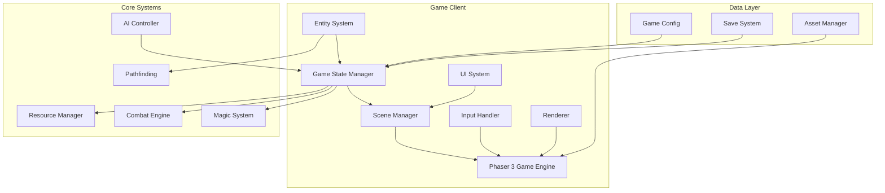
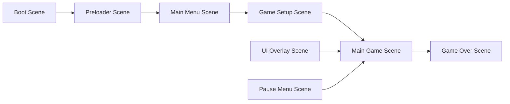

# RTS Game Design Document

## Overview

This design document details the technical architecture and implementation approach for the RTS game combining Heroes of Might and Magic and Red Alert elements. The game will be built using Phaser 3 framework with a focus on real-time gameplay, strategic depth, and scalable architecture.

## Architecture

### High-Level Architecture



### Scene Architecture

The game will use Phaser 3's scene system with the following structure:



#### Scene Descriptions

- **Boot Scene**: Initialize game configuration and load essential assets
- **Preloader Scene**: Load all game assets with progress bar
- **Main Menu Scene**: Title screen with game options
- **Game Setup Scene**: Configure game settings (map size, players, difficulty)
- **Main Game Scene**: Core gameplay with tilemap and entities
- **UI Overlay Scene**: Persistent UI elements (resource bar, minimap, command panels)
- **Pause Menu Scene**: In-game pause with settings
- **Game Over Scene**: Victory/defeat screen with statistics

## Components and Interfaces

### Core Components

#### 1. Game State Manager
```javascript
class GameStateManager {
    constructor() {
        this.players = [];
        this.currentTick = 0;
        this.gameSpeed = 1.0;
        this.isPaused = false;
        this.winner = null;
    }
    
    update(delta) {
        // Update game tick
        // Process resource generation
        // Check victory conditions
    }
    
    addPlayer(playerConfig) {}
    removePlayer(playerId) {}
    checkVictoryConditions() {}
}
```

#### 2. Entity Component System

```javascript
class Entity {
    constructor(id, type, owner) {
        this.id = id;
        this.type = type;
        this.owner = owner;
        this.components = new Map();
    }
    
    addComponent(name, component) {}
    getComponent(name) {}
    removeComponent(name) {}
}

// Component examples
class PositionComponent {
    constructor(x, y) {
        this.x = x;
        this.y = y;
        this.tileX = Math.floor(x / TILE_SIZE);
        this.tileY = Math.floor(y / TILE_SIZE);
    }
}

class CombatComponent {
    constructor(power, isRanged = false) {
        this.power = power;
        this.isRanged = isRanged;
        this.bonuses = [];
    }
}

class MovementComponent {
    constructor(speed) {
        this.speed = speed;
        this.path = [];
        this.isMoving = false;
    }
}
```

#### 3. Castle System

```javascript
class Castle extends Entity {
    constructor(id, owner, tileX, tileY, faction) {
        super(id, 'castle', owner);
        this.faction = faction;
        this.buildings = [];
        this.garrisonArmy = null;
        this.productionQueue = [];
        this.level = 1;
        
        // Add components
        this.addComponent('position', new PositionComponent(tileX * TILE_SIZE, tileY * TILE_SIZE));
        this.addComponent('resource', new ResourceGeneratorComponent());
        this.addComponent('defense', new DefenseComponent());
    }
    
    addBuilding(buildingType) {}
    produceUnit(unitType) {}
    setGarrison(army) {}
}

class Building {
    constructor(type, castle) {
        this.type = type;
        this.castle = castle;
        this.level = 1;
        this.productionRate = BUILDING_CONFIGS[type].baseRate;
    }
    
    upgrade() {}
    getProductionBonus() {}
}
```

#### 4. Army System

```javascript
class Army extends Entity {
    constructor(id, owner) {
        super(id, 'army', owner);
        this.units = new Map(); // unitType -> count
        this.spellQueue = [];
        
        this.addComponent('position', new PositionComponent(0, 0));
        this.addComponent('movement', new MovementComponent(this.calculateSpeed()));
        this.addComponent('combat', new CombatComponent(this.calculatePower()));
    }
    
    addUnits(unitType, count) {}
    removeUnits(unitType, count) {}
    calculatePower() {}
    calculateSpeed() {}
    merge(otherArmy) {}
    split(unitDistribution) {}
}

class Unit {
    constructor(type, faction) {
        this.type = type;
        this.faction = faction;
        this.basePower = UNIT_CONFIGS[faction][type].power;
        this.baseSpeed = UNIT_CONFIGS[faction][type].speed;
        this.abilities = UNIT_CONFIGS[faction][type].abilities || [];
    }
}
```

#### 5. Resource System

```javascript
class ResourceManager {
    constructor(player) {
        this.player = player;
        this.resources = {
            gold: 0,
            mana: 0,
            wood: 0,
            stone: 0,
            mercury: 0,
            sulfur: 0,
            crystal: 0
        };
        this.generation = {
            gold: 0,
            mana: 0
        };
    }
    
    update(delta) {
        // Apply generation rates
        this.resources.gold += (this.generation.gold * delta / 60000); // per minute
        this.resources.mana += (this.generation.mana * delta / 60000);
    }
    
    canAfford(cost) {}
    spend(cost) {}
    add(resources) {}
}
```

### UI System Design

#### Command Panel Architecture

```javascript
class CommandPanel extends Phaser.GameObjects.Container {
    constructor(scene, x, y) {
        super(scene, x, y);
        this.background = this.createBackground();
        this.buttons = [];
        this.currentSelection = null;
    }
    
    showEntityCommands(entity) {
        this.clearButtons();
        
        if (entity.type === 'castle') {
            this.showCastleCommands(entity);
        } else if (entity.type === 'army') {
            this.showArmyCommands(entity);
        }
    }
    
    createButton(x, y, text, callback) {}
    clearButtons() {}
}

class ResourceBar extends Phaser.GameObjects.Container {
    constructor(scene, player) {
        super(scene, 0, 0);
        this.player = player;
        this.resourceDisplays = this.createResourceDisplays();
    }
    
    update() {
        // Update resource display values
    }
}

class Minimap extends Phaser.GameObjects.Container {
    constructor(scene, worldWidth, worldHeight) {
        super(scene, 0, 0);
        this.worldWidth = worldWidth;
        this.worldHeight = worldHeight;
        this.minimapTexture = this.createMinimapTexture();
    }
    
    updateVisibility(visibleTiles) {}
    updateEntityPositions(entities) {}
}
```

## Data Models

### Configuration Data

```javascript
const GAME_CONFIG = {
    tileSize: 64,
    defaultMapSize: 64,
    maxMapSize: 256,
    minMapSize: 32,
    baseResourceGeneration: {
        gold: 60,  // per minute
        mana: 60   // per minute
    },
    factionBonuses: {
        human: {
            manaGeneration: 1.25
        },
        orc: {
            goldGeneration: 1.25
        }
    }
};

const TERRAIN_TYPES = {
    grassland: { movementCost: 1.0, passable: true },
    mountain: { movementCost: Infinity, passable: false },
    forest: { movementCost: 2.0, passable: true, combatBonus: 1.1 },
    water: { movementCost: Infinity, passable: false },
    road: { movementCost: 0.5, passable: true },
    desert: { movementCost: 1.5, passable: true, visibilityPenalty: 0.8 },
    plains: { movementCost: 1.0, passable: true },
    swamp: { movementCost: 2.0, passable: true, combatBonus: 1.1 },
    snow: { movementCost: 1.5, passable: true, visibilityPenalty: 0.8 },
    lake: { movementCost: 2.0, passable: true, combatPenalty: 0.9 }
};

const UNIT_CONFIGS = {
    human: {
        swordsman: { power: 5, speed: 10, cost: { gold: 50 } },
        archer: { power: 8, speed: 5, cost: { gold: 75 }, isRanged: true },
        knight: { power: 20, speed: 100, cost: { gold: 200 } },
        wizard: { power: 15, speed: 10, cost: { gold: 150, mana: 50 }, canCastSpells: true },
        paladin: { power: 50, speed: 80, cost: { gold: 500 }, ability: 'powerBoost' }
    },
    orc: {
        warrior: { power: 6, speed: 10, cost: { gold: 50 } },
        archer: { power: 9, speed: 5, cost: { gold: 75 }, isRanged: true },
        wolfRider: { power: 15, speed: 120, cost: { gold: 180 } },
        shaman: { power: 14, speed: 10, cost: { gold: 140, mana: 40 }, canCastSpells: true },
        berserker: { power: 55, speed: 75, cost: { gold: 550 }, ability: 'rage' },
        ogre: { power: 30, speed: 15, cost: { gold: 300 }, antiCastle: 1.5 }
    }
};

const BUILDING_CONFIGS = {
    // Unit production
    barracks: { 
        cost: { gold: 500, wood: 100 }, 
        produces: ['swordsman', 'warrior'],
        baseRate: 60000  // 1 unit per minute
    },
    archeryRange: { 
        cost: { gold: 750, wood: 150 }, 
        produces: ['archer'],
        baseRate: 90000
    },
    stables: { 
        cost: { gold: 1500, wood: 200, stone: 100 }, 
        produces: ['knight', 'wolfRider'],
        baseRate: 120000
    },
    magicTower: { 
        cost: { gold: 2000, stone: 200, crystal: 50 }, 
        produces: ['wizard', 'shaman'],
        baseRate: 150000
    },
    
    // Resource generation
    goldMine: { 
        cost: { gold: 1000, stone: 100 }, 
        generates: { gold: 30 }  // per minute bonus
    },
    manaWell: { 
        cost: { gold: 1000, crystal: 50 }, 
        generates: { mana: 30 }
    },
    
    // Defense
    walls: { 
        cost: { gold: 2000, stone: 500 }, 
        defenseBonus: 1.5,
        hitPoints: 1000
    },
    watchtower: { 
        cost: { gold: 500, wood: 200 }, 
        visionRange: 10,
        defenseBonus: 1.2
    }
};
```

### Game State Model

```javascript
class GameState {
    constructor() {
        this.players = [];
        this.entities = new Map();
        this.map = null;
        this.visibility = new Map(); // playerId -> visible tiles
        this.currentTick = 0;
        this.gameSpeed = 1.0;
        this.settings = {
            mapSize: 64,
            difficulty: 'normal',
            maxPlayers: 8,
            victoryConditions: ['elimination', 'economic']
        };
    }
    
    serialize() {
        // Convert to saveable format
    }
    
    deserialize(data) {
        // Load from saved data
    }
}

class Player {
    constructor(id, name, faction, isAI = false) {
        this.id = id;
        this.name = name;
        this.faction = faction;
        this.isAI = isAI;
        this.resourceManager = new ResourceManager(this);
        this.spellLibrary = [];
        this.isAlive = true;
        this.color = this.assignColor();
    }
}
```

## Combat System Design

### Combat Resolution Algorithm

```javascript
class CombatEngine {
    resolveCombat(attacker, defender, terrain) {
        // Get base powers
        let attackerPower = attacker.getComponent('combat').power;
        let defenderPower = defender.getComponent('combat').power;
        
        // Apply terrain modifiers
        attackerPower *= terrain.combatBonus || 1.0;
        defenderPower *= terrain.combatBonus || 1.0;
        
        // Apply castle defense bonus if applicable
        if (defender.type === 'castle') {
            const defenseComp = defender.getComponent('defense');
            defenderPower = (defenderPower + defenseComp.buildingPower) * defenseComp.multiplier;
        }
        
        // Resolve spells first
        this.resolveSpells(attacker, defender);
        
        // Apply spell effects
        attackerPower *= this.getSpellMultiplier(attacker);
        defenderPower *= this.getSpellMultiplier(defender);
        
        // Determine winner
        if (attackerPower > defenderPower) {
            return {
                winner: attacker,
                remainingPower: attackerPower - defenderPower,
                loser: defender
            };
        } else if (defenderPower > attackerPower) {
            return {
                winner: defender,
                remainingPower: defenderPower - attackerPower,
                loser: attacker
            };
        } else {
            return {
                winner: null,
                remainingPower: 0,
                loser: null,
                draw: true
            };
        }
    }
    
    resolveSpells(attacker, defender) {
        // Process spell queue FIFO
        if (attacker.spellQueue && attacker.spellQueue.length > 0) {
            const spell = attacker.spellQueue.shift();
            this.applySpell(spell, attacker, defender);
        }
        
        if (defender.spellQueue && defender.spellQueue.length > 0) {
            const spell = defender.spellQueue.shift();
            this.applySpell(spell, defender, attacker);
        }
    }
}
```

## Magic System Design

### Spell Selection System

```javascript
class MagicSystem {
    constructor(gameState) {
        this.gameState = gameState;
        this.spellPool = this.initializeSpellPool();
        this.selectionInterval = 180000; // 3 minutes
        this.lastSelectionTime = 0;
    }
    
    update(currentTime) {
        if (currentTime - this.lastSelectionTime >= this.selectionInterval) {
            this.triggerSpellSelection();
            this.lastSelectionTime = currentTime;
        }
    }
    
    triggerSpellSelection() {
        this.gameState.players.forEach(player => {
            if (player.isAlive && !player.isAI) {
                const options = this.generateSpellOptions(player);
                this.showSpellSelectionUI(player, options);
            }
        });
    }
    
    generateSpellOptions(player) {
        const available = this.spellPool.filter(spell => 
            !player.spellLibrary.includes(spell.id) &&
            this.meetsRequirements(player, spell)
        );
        
        // Apply rarity weights
        const weighted = this.applyRarityWeights(available, player);
        
        // Select 3 random options
        return this.selectRandom(weighted, 3);
    }
}

class Spell {
    constructor(config) {
        this.id = config.id;
        this.name = config.name;
        this.type = config.type; // 'damage', 'buff', 'debuff'
        this.manaCost = config.manaCost;
        this.effect = config.effect;
        this.duration = config.duration || 0;
        this.rarity = config.rarity; // 'common', 'rare', 'epic'
    }
    
    canCast(player) {
        return player.resourceManager.resources.mana >= this.manaCost;
    }
    
    cast(caster, target) {
        if (this.type === 'damage') {
            return new DamageSpellInstance(this, caster, target);
        } else if (this.type === 'buff') {
            return new BuffSpellInstance(this, caster, target);
        }
    }
}
```

## Pathfinding System

### A* Implementation for Army Movement

```javascript
class PathfindingSystem {
    constructor(map) {
        this.map = map;
        this.grid = this.createNavigationGrid();
    }
    
    findPath(startTile, endTile, unit) {
        const openList = new PriorityQueue();
        const closedList = new Set();
        const cameFrom = new Map();
        const gScore = new Map();
        const fScore = new Map();
        
        const startKey = `${startTile.x},${startTile.y}`;
        gScore.set(startKey, 0);
        fScore.set(startKey, this.heuristic(startTile, endTile));
        openList.enqueue(startTile, fScore.get(startKey));
        
        while (!openList.isEmpty()) {
            const current = openList.dequeue();
            const currentKey = `${current.x},${current.y}`;
            
            if (current.x === endTile.x && current.y === endTile.y) {
                return this.reconstructPath(cameFrom, current);
            }
            
            closedList.add(currentKey);
            
            const neighbors = this.getNeighbors(current);
            for (const neighbor of neighbors) {
                const neighborKey = `${neighbor.x},${neighbor.y}`;
                
                if (closedList.has(neighborKey)) continue;
                
                const terrain = this.map.getTerrain(neighbor.x, neighbor.y);
                if (!terrain.passable) continue;
                
                const tentativeGScore = gScore.get(currentKey) + terrain.movementCost;
                
                if (!gScore.has(neighborKey) || tentativeGScore < gScore.get(neighborKey)) {
                    cameFrom.set(neighborKey, current);
                    gScore.set(neighborKey, tentativeGScore);
                    fScore.set(neighborKey, tentativeGScore + this.heuristic(neighbor, endTile));
                    
                    if (!openList.contains(neighbor)) {
                        openList.enqueue(neighbor, fScore.get(neighborKey));
                    }
                }
            }
        }
        
        return []; // No path found
    }
    
    heuristic(a, b) {
        // Manhattan distance
        return Math.abs(a.x - b.x) + Math.abs(a.y - b.y);
    }
}
```

## AI System Design

### AI Controller Architecture

```javascript
class AIController {
    constructor(player, difficulty) {
        this.player = player;
        this.difficulty = difficulty;
        this.personality = this.generatePersonality();
        this.strategies = {
            economic: new EconomicStrategy(this),
            military: new MilitaryStrategy(this),
            expansion: new ExpansionStrategy(this)
        };
        this.currentStrategy = null;
        this.decisionInterval = this.getDecisionInterval();
    }
    
    update(gameState, deltaTime) {
        // Periodic decision making
        if (this.shouldMakeDecision(deltaTime)) {
            this.evaluateStrategies(gameState);
            this.executeStrategy(gameState);
        }
        
        // Continuous actions
        this.manageProduction(gameState);
        this.manageArmies(gameState);
    }
    
    generatePersonality() {
        // Based on faction and difficulty
        if (this.player.faction === 'orc') {
            return {
                aggression: 0.8,
                expansion: 0.7,
                defense: 0.3,
                economy: 0.5
            };
        } else {
            return {
                aggression: 0.4,
                expansion: 0.5,
                defense: 0.8,
                economy: 0.7
            };
        }
    }
    
    getDecisionInterval() {
        const base = 10000; // 10 seconds
        const difficultyMultiplier = {
            easy: 2.0,
            normal: 1.0,
            hard: 0.5
        };
        return base * difficultyMultiplier[this.difficulty];
    }
}

class Strategy {
    constructor(ai) {
        this.ai = ai;
        this.priority = 0;
    }
    
    evaluate(gameState) {
        // Return priority score
    }
    
    execute(gameState) {
        // Implement strategy
    }
}
```

## Error Handling

### Error Management Strategy

```javascript
class ErrorHandler {
    static init(game) {
        window.addEventListener('error', (event) => {
            this.handleError(event.error, 'global');
        });
        
        window.addEventListener('unhandledrejection', (event) => {
            this.handleError(event.reason, 'promise');
        });
    }
    
    static handleError(error, source) {
        console.error(`Error from ${source}:`, error);
        
        // Log to error tracking service
        if (window.errorTracker) {
            window.errorTracker.log(error);
        }
        
        // Show user-friendly message
        if (error.severity === 'critical') {
            this.showErrorDialog('A critical error occurred. Please refresh the page.');
        } else {
            this.showErrorNotification(error.message || 'An error occurred.');
        }
    }
    
    static handleNetworkError(error) {
        if (error.code === 'CONNECTION_LOST') {
            this.attemptReconnection();
        } else {
            this.showErrorDialog('Network error. Please check your connection.');
        }
    }
}

// Custom error types
class GameError extends Error {
    constructor(message, severity = 'normal') {
        super(message);
        this.name = 'GameError';
        this.severity = severity;
    }
}

class ValidationError extends GameError {
    constructor(message) {
        super(message, 'warning');
        this.name = 'ValidationError';
    }
}
```

## Testing Strategy

### Unit Testing Approach

```javascript
// Example test structure for Jest
describe('CombatEngine', () => {
    let combatEngine;
    
    beforeEach(() => {
        combatEngine = new CombatEngine();
    });
    
    test('should resolve combat with clear winner', () => {
        const attacker = createMockArmy(100);
        const defender = createMockArmy(80);
        
        const result = combatEngine.resolveCombat(attacker, defender, TERRAIN_TYPES.grassland);
        
        expect(result.winner).toBe(attacker);
        expect(result.remainingPower).toBe(20);
        expect(result.loser).toBe(defender);
    });
    
    test('should apply terrain bonuses correctly', () => {
        const attacker = createMockArmy(100);
        const defender = createMockArmy(100);
        
        const result = combatEngine.resolveCombat(attacker, defender, TERRAIN_TYPES.forest);
        
        // Both get 10% bonus in forest, so it's still a draw
        expect(result.draw).toBe(true);
    });
});

describe('ResourceManager', () => {
    test('should generate resources over time', () => {
        const player = createMockPlayer();
        const resourceManager = new ResourceManager(player);
        resourceManager.generation.gold = 60; // per minute
        
        // Simulate 30 seconds
        resourceManager.update(30000);
        
        expect(resourceManager.resources.gold).toBe(30);
    });
});
```

### Integration Testing

```javascript
describe('Game Flow Integration', () => {
    let game;
    
    beforeEach(() => {
        game = new Phaser.Game(testConfig);
    });
    
    test('should complete a full game cycle', async () => {
        // Start game
        await game.scene.start('MainGame');
        
        // Create players
        const human = game.state.addPlayer({ faction: 'human', isAI: false });
        const ai = game.state.addPlayer({ faction: 'orc', isAI: true });
        
        // Verify initial state
        expect(human.resourceManager.resources.gold).toBe(0);
        expect(ai.resourceManager.resources.gold).toBe(0);
        
        // Simulate game time
        await simulateGameTime(60000); // 1 minute
        
        // Verify resource generation
        expect(human.resourceManager.resources.gold).toBeGreaterThan(0);
        
        // Verify AI actions
        expect(ai.armies.length).toBeGreaterThan(0);
    });
});
```

### Performance Testing

```javascript
class PerformanceMonitor {
    constructor(game) {
        this.game = game;
        this.metrics = {
            fps: [],
            updateTime: [],
            renderTime: [],
            entityCount: [],
            memoryUsage: []
        };
    }
    
    startMonitoring() {
        this.game.events.on('postupdate', this.recordMetrics, this);
    }
    
    recordMetrics() {
        this.metrics.fps.push(this.game.loop.actualFps);
        this.metrics.entityCount.push(this.game.state.entities.size);
        
        if (performance.memory) {
            this.metrics.memoryUsage.push(performance.memory.usedJSHeapSize);
        }
    }
    
    generateReport() {
        return {
            avgFps: this.average(this.metrics.fps),
            minFps: Math.min(...this.metrics.fps),
            maxEntities: Math.max(...this.metrics.entityCount),
            memoryGrowth: this.calculateMemoryGrowth()
        };
    }
}
```

## Optimization Strategies

### Rendering Optimization

1. **Sprite Batching**: Group similar sprites to reduce draw calls
2. **Culling**: Only render entities within viewport + margin
3. **LOD System**: Reduce detail for distant objects
4. **Texture Atlases**: Combine sprites to reduce texture swaps

### Performance Optimization

1. **Object Pooling**: Reuse objects for particles, projectiles, and UI elements
2. **Spatial Indexing**: Use quadtree for efficient collision detection
3. **Update Throttling**: Update different systems at different frequencies
4. **Web Workers**: Offload pathfinding and AI calculations

### Memory Optimization

1. **Asset Management**: Unload unused assets between scenes
2. **Entity Cleanup**: Properly destroy entities and remove references
3. **Event Management**: Remove event listeners when not needed
4. **Texture Compression**: Use compressed formats for large textures

## Deployment Considerations

### Build Pipeline

1. **Asset Pipeline**: Optimize images, create sprite atlases, compress audio
2. **Code Bundling**: Use webpack/rollup for efficient bundling
3. **Minification**: Minify JavaScript and CSS
4. **Progressive Loading**: Load essential assets first, then additional content

### Browser Compatibility

1. **WebGL Fallback**: Canvas renderer for older browsers
2. **Polyfills**: Support for missing JavaScript features
3. **Progressive Enhancement**: Basic functionality on all browsers
4. **Performance Profiles**: Different quality settings based on device capability